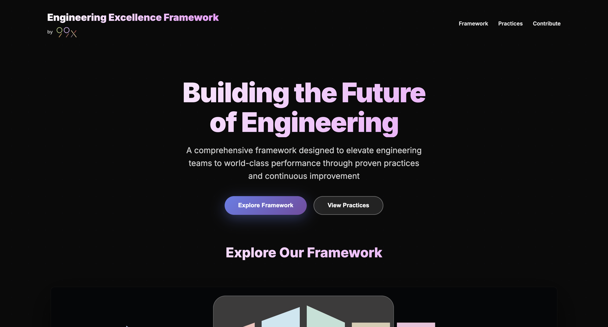

<div align="center">

</div>

# 99x Engineering Excellence Framework 

 

This repository contains the 99x Engineering Excellence Framework, a comprehensive framework designed to elevate engineering teams to world-class performance through proven practices and continuous improvement.

For presentation purposes, repository uses a minimal React app (Create React App) used as a shell and a collection of static, content-rich practice pages served from `public/practices/`.

Browse [99x Engineering Excellence Framework](https://99x-incubator.github.io/engineering-excellence-framework/) 

## Quickstart

1. Install

   ```bash
   npm install
   ```

2. Run locally

   ```bash
   npm start
   ```

3. Build for production

   ```bash
   npm run build
   ```
4. Deploy to Github Pages

   ```bash
   npm run deploy
   ```

## Structure at a glance

- `public/`
  - `practices/` — standalone HTML pages (e.g., `version-control.html`)
  - `framework.jpg` — visual representation of the framework
  - `99xlogo.svg` — inline logo used in the header
- `src/`
  - `App.js` — site shell and list of practice cards
  - `App.css` — styles
- `package.json` — scripts and dependencies

## How the practice pages are organized

Each page in `public/practices/` is a simple, self-contained HTML document that includes:

- A short overview
- Key aspects
- Risks (with IDs)
- PHR Guidelines / Work Instructions

## 🤝 Contributing

We love contributions! Whether it’s fixing a typo, adding a new topic, or improving an existing topic — your help makes this knowledge base smarter.  

### How to Contribute

1. **Fork** this repository.  
2. **Create a new branch** for your changes:  
   ```bash
   git checkout -b feature/add-new-topic
   ```
   
3. Make your edits — keep things clear, factual, and consistent.
4. Commit your changes with a clear message:
   ```bash
   git commit -m "Add guide on asynchronous design patterns"
   ```
5. Push to your branch and open a Pull Request.

### Credits

© 2025 99x Engineering Excellence Framework
